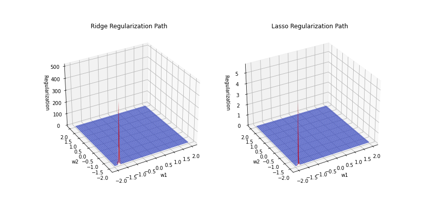
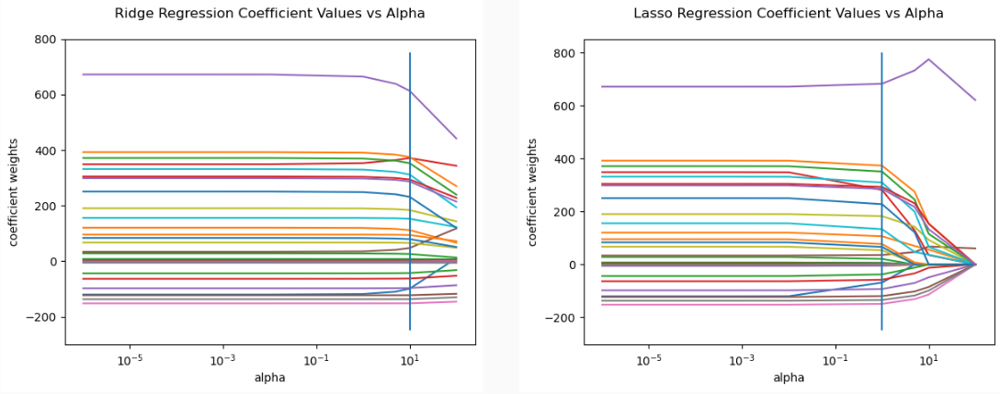

# Lasso/Ridge Regression

This is a project completed by the DEV10 Associates listed below in Week 9 of the 13-week bootcamp. It characterizes and investigates the Lasso and Ridge Regression algorithms on several datasets. The datasets used in this project include the `cars93` dataset from the Cooper Union, the `diabetes` dataset from scikit-learn, and a `diamonds` dataset from Kaggle.

## Group Members

- [Jake](/Jake)
- [Jessica](/Jessica)
- [Jesse](/Jesse)

## Contributions

- Jessica Hoffman: Investigated the effect of regularization strength on the Lasso and Ridge regression coefficients on the `cars93` dataset and the [Cooper Union Car Dataset](https://www.kaggle.com/datasets/CooperUnion/cardataset) to see if model drift impacted later model vehicle price prediction. 
- Jake Uhl: Compared the performance of the Lasso and Ridge regression algorithms on the `diabetes` dataset.
- Jesse Noss: Compared the performance of the Lasso and Ridge regression algorithms on the [`diamonds`](https://www.kaggle.com/datasets/swatikhedekar/price-prediction-of-diamond) dataset, and looked into the effect of appending extra columns with randomly assigned values to the original dataset.

## Key Figures

Here are some key figures from the notebook:

### Figure 1: Cars93 Dataset EDA

### Figure 2: Lasso and Ridge Regimes on Cars Dataset

### Figure 3: Ridge and Lasso Regularization Paths

### Figure 4: New Cars Dataset EDA

### Figure 5: Lasso, Ridge, and Linear Regression Scores

### Figure 6: Ridge and Lasso Regularization Paths

### Figure 7: Feature Coefficient Weight Change as Alpha Increases (log scale)

## PowerPoint Presentation

[Click here](./Lasso_Ridge%20Regression.pptx)
 to view our PowerPoint presentation.

or [here](./Lasso_Ridge%20Regression.pdf) for the pdf format: 
