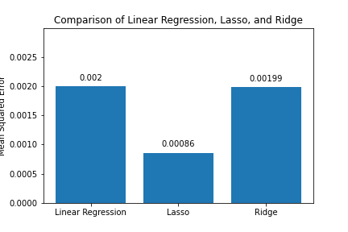

# Lasso/Ridge Regression

This is a project completed by the DEV10 Associates listed below in Week 9 of the 13-week bootcamp. It characterizes and investigates the Lasso and Ridge Regression algorithms on several datasets. The datasets used in this project include the `cars93` dataset from the Cooper Union, the `diabetes` dataset from scikit-learn, and a `diamonds` dataset from Kaggle.

## Group Members

- [Jake](https://github.com/LassoRidge/Jake)
- [Jessica](https://github.com/LassoRidge/Jessica)
- [Jesse](https://github.com/LassoRidge/Jesse)

## Contributions

- Jessica Hoffman: Investigated the effect of regularization strength on the Lasso and Ridge regression coefficients on the `cars93` dataset and the [Cooper Union Car Dataset](https://www.kaggle.com/datasets/CooperUnion/cardataset) to see if model drift impacted later model vehicle price prediction. 
- Jake Uhl: Compared the performance of the Lasso and Ridge regression algorithms on the `diabetes` dataset.
- Jesse Noss: ACompared the performance of the Lasso and Ridge regression algorithms on the `diamonds` dataset.

## Key Figures

Here are some key figures from the notebook:

### Figure 1: Cars93 Dataset EDA

### Figure 2: Lasso and Ridge Regimes on Cars Dataset

### Figure 3: Ridge and Lasso Regularization Paths

### Figure 4: New Cars Dataset EDA

### Figure 5: Lasso, Ridge, and Linear Regression Scores

### Figure 6: Ridge and Lasso Regularization Paths
[Click here](Lasso_Ridge_Regression.pptx)
 to view our PowerPoint presentation.

## PowerPoint Presentation

[Click here](Lasso_Ridge_Regression.pptx)
 to view our PowerPoint presentation.

or here for the pdf format: <iframe src="https://docs.google.com/presentation/d/1yyS6t0EiZl2tdnu4EJhNu8VPLVq_B0fP9uP9RKE_nDs/edit?usp=sharing" width="640" height="480"></iframe>
